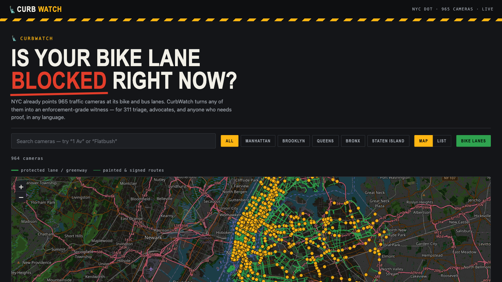
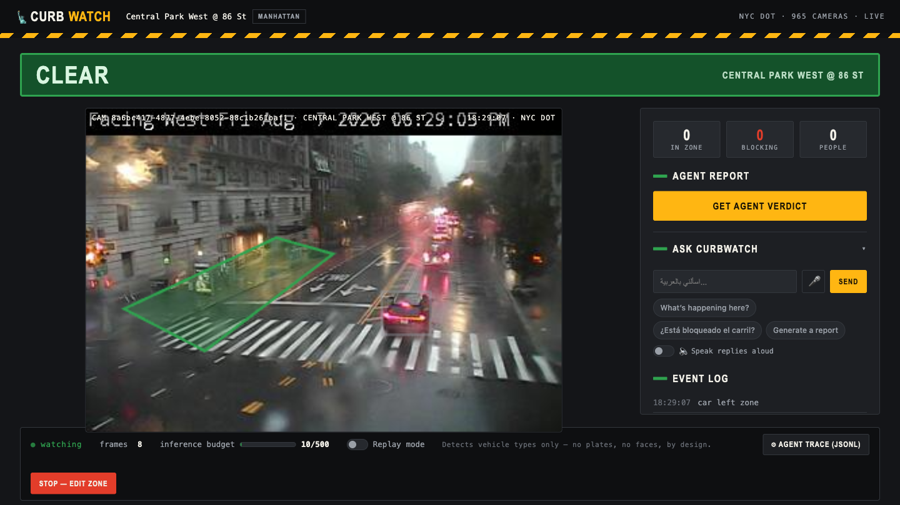
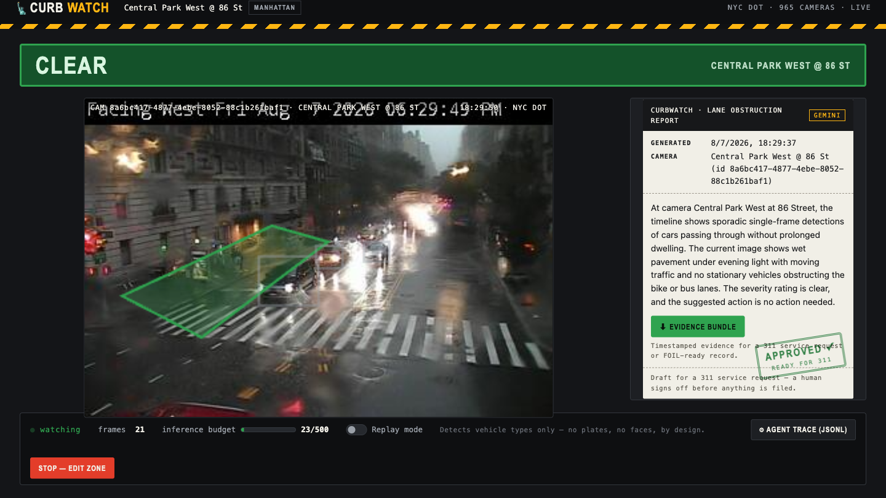
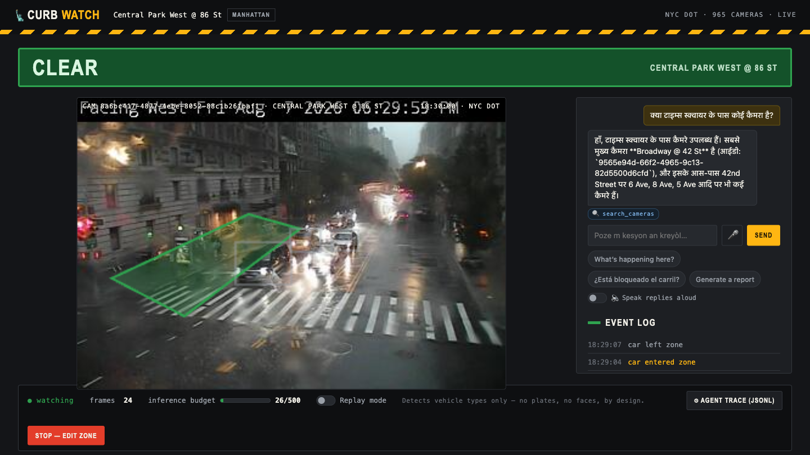
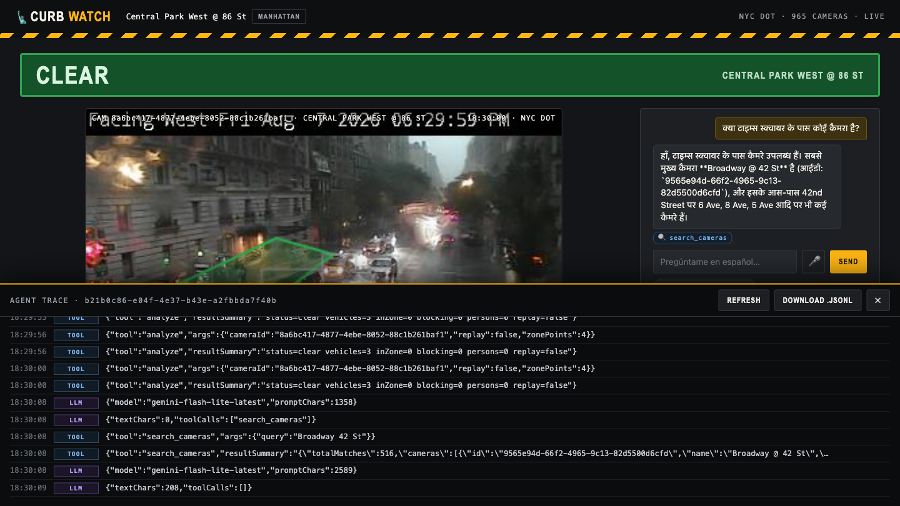

# CurbWatch — 3-Minute Demo Script

**Live:** https://curbwatch-631243785209.us-central1.run.app
**Repo:** https://github.com/roshaninfordham/NYC-Vision-Hack-2026

> Read the **bold** lines aloud. Everything else is what you click.
> Total: ~3:00. Every step runs on live NYC feeds — no mock data.

---

## 0:00 — The hook (20 seconds, on the landing page)

Open the live URL. The map is already loaded: yellow dots over a glowing green network.

> **"New York City gets over a million illegal-parking complaints to 311 every year.
> Tens of thousands are blocked bike lanes. Almost all of them are closed with no
> action — because by the time anyone responds, the car is gone. There's no evidence.**
>
> **But the city already owns 963 traffic cameras, and they're pointed at those exact
> lanes. Every yellow dot is a live camera. Every green line is a bike lane, from NYC
> Open Data. CurbWatch turns any of those cameras into an enforcement-grade witness —
> for 311 triage, for advocates, and for any New Yorker, in any language."**

**Backup if the map is slow:** click **LIST** — the same 963 cameras as a searchable list.

---

## 0:20 — Step 1: Pick a camera (20 seconds)

1. Type **`Central Park West @ 86`** in the search box.
2. Click the camera dot (or the list row) → **Watch this camera**.

> **"I'll pick Central Park West at 86th Street — a protected bike lane, and you can see
> the green lane running right through it. That's a live frame, refreshing every couple
> of seconds, straight from the DOT."**

---

## 0:40 — Step 2: Trace the lane (25 seconds)

3. **Click 4 corners** around the red/green bike lane on the frame (roughly — it doesn't
   need to be precise).
4. Click **Done** (turns green), then **Start watching** (spinner → first frame).

> **"I trace the lane once — four clicks. This is the only setup. Now the agent knows
> what 'the lane' means at this camera, and it starts watching."**

---

## 1:05 — Step 3: Watch it work (30 seconds)

Boxes appear on the frame within ~3 seconds. Point at the banner as it changes.

> **"Every three seconds we pull a frame and run object detection through Roboflow's
> hosted inference — that's their COCO model, about 130 milliseconds per frame. But a
> single detection isn't evidence. The real logic is in our tracker: it matches each
> vehicle across frames by overlap, so it knows *this* car is the same car it saw three
> seconds ago. A car driving through is ignored. A car that *sits* in the lane for three
> consecutive frames is blocking — and the banner escalates."**

5. **Click directly on any vehicle's box** → it target-locks (cyan crosshair).

> **"And I can lock onto one specific vehicle. Now that crosshair follows *that* car,
> frame after frame, with a live clock on how long it's been there — even if it drifts
> out of the zone. That's the difference between 'a car was here' and 'this vehicle
> has blocked the lane for 40 seconds.'"**

---

## 1:35 — Step 4: The agent verdict (35 seconds)

6. Click **Get agent verdict** (spinner → report card).

> **"Now Gemini writes the report. And this is the part I care about most: we don't just
> hand Gemini the detector's output — we send it **the actual camera frame**. It looks at
> the picture, checks the detector's labels against what it can see, and corrects them.
> It will tell you the detector was wrong. It'll say 'that's a city bus in its own lane,
> not a blockage.' That's what makes this evidence instead of a guess."**

7. Click **Approve** → the green inspection stamp appears.

> **"A human signs off. Nothing gets filed on an AI's say-so."**

8. Click **⬇ Evidence bundle** → a JSON file downloads.

> **"And that's the deliverable: camera, coordinates, timestamp, the report, the human
> decision, the keyframe, and the complete agent trace — one file, ready to attach to a
> 311 request or keep as a public record."**

---

## 2:10 — Step 5: Ask it anything, in any language (30 seconds)

In the **Ask CurbWatch** panel, click a suggested chip or type. Use **one** of these:

| Language | Type this | What happens |
|---|---|---|
| Hindi | `क्या टाइम्स स्क्वायर के पास कोई कैमरा है?` | Answers in Hindi, finds Broadway @ 42 St |
| Spanish | `¿Está bloqueado el carril?` | Answers in Spanish using live lane state |
| Nepali | `ब्रुकलिनमा कतिवटा क्यामेरा छन्?` | Answers in Nepali with Brooklyn camera count |
| English | `What's happening here?` | Live scene summary |

> **"NYC speaks over 800 languages, and 311 is English-first. Watch this — I'll ask in
> Hindi whether there's a camera at Times Square."**
>
> *(agent replies in Hindi)*
>
> **"Two things happened there. It answered in my language. And notice — no DOT camera
> is named 'Times Square.' They're named by cross-streets. The agent knew to translate
> the landmark into Broadway at 42nd Street before searching. It picks its own tools:
> search the camera network, analyze a frame, check lane status, write a report."**

You can also click the **🎤 mic** and speak the question — voice in, voice out.

---

## 2:40 — Step 6: Show the receipts, then close (20 seconds)

9. Click **⚙ Agent trace (JSONL)** in the footer bar.

> **"Every step the agent took — each Gemini call, each tool call, each verdict, each
> human decision — is logged as JSONL, downloadable. That's how you evaluate an agent
> and improve it, instead of trusting it."**

> **"CurbWatch runs entirely on Google Cloud Run — one container, scale-to-zero, so
> watching a lane costs cents. Detection is Roboflow's hosted API, reasoning is Gemini
> Flash-Lite, the cheapest tier, called once per report instead of once per frame.
> Nothing is stored beyond your session. And by design, it reads vehicle types only —
> no plates, no faces.**
>
> **The city already paid for the cameras. CurbWatch is the part that makes them act."**

---

## Edge cases — what to do if something breaks

| If… | Do this |
|---|---|
| **A camera goes dark / frame stalls** | Flip **Replay mode** in the footer — 12 committed frames with cached detections, same pipeline, zero inference cost. Reaches LANE BLOCKED reliably. |
| **Map tiles don't load** | It auto-falls back to the list view. Or click **LIST**. |
| **Inference budget hits the cap** | The UI says so and offers Replay mode. (Budget: 500 calls; a full demo uses ~15.) |
| **Gemini is slow** | The report button spins; give it ~3 s. If it fails it degrades to a templated verdict, still with the timeline. |
| **Mic doesn't appear** | Chrome only. Just type instead — same agent, same result. |
| **Camera pans mid-demo** | Some DOT cameras rotate on a schedule. Click **STOP — EDIT ZONE**, retrace, restart. CPW @ 86 St is stable. |

**Pre-demo checklist (60 seconds before you go on):**
1. Open the live URL and let the map load.
2. Search + select CPW @ 86 St, trace the lane, start watching — confirm boxes appear.
3. Click **Get agent verdict** once — confirms Gemini is warm (Cloud Run cold start).
4. Leave it on that screen.

---

## The one-paragraph pitch (if you only get 30 seconds)

> **CurbWatch turns New York's 963 existing traffic cameras into enforcement-grade
> witnesses for blocked bike and bus lanes. You pick a camera, trace the lane once, and
> an agent watches: Roboflow detects vehicles, our tracker proves one *stayed* rather
> than passed through, and Gemini — looking at the actual frame, not just the detector's
> labels — writes a 311-ready report in your language, which a human approves before it
> goes anywhere. It exports as a timestamped evidence bundle with a full JSONL audit
> trail of everything the AI did. It runs on Cloud Run for cents, and it reads vehicle
> types only — no plates, no faces, by design.**
