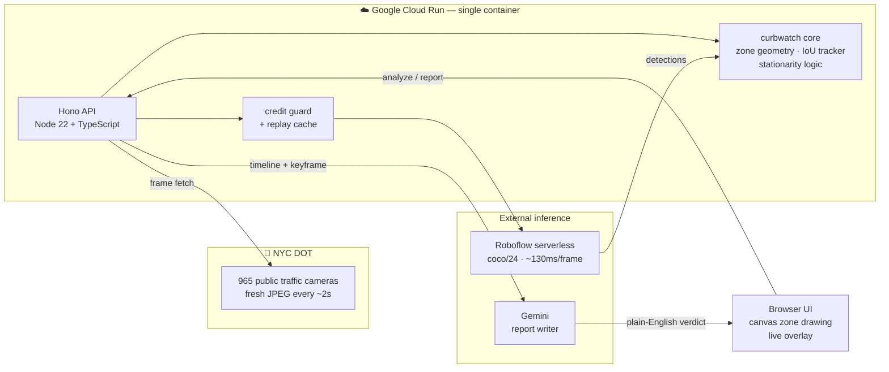
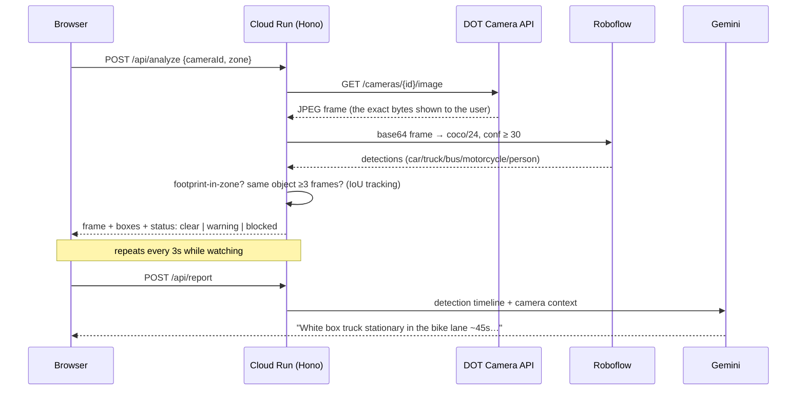

# 🗽 CurbWatch

**An agentic vision system that watches NYC's 900+ public traffic cameras and calls out
vehicles blocking bike and bus lanes — with a plain-English report you could hand to 311.**

Built in one evening at [AI Tinkerers NYC — Vision Hack v.2](https://nyc.aitinkerers.org/)
(Aug 7, 2026). Deployed on **Google Cloud Run**. Detection by **Roboflow**. Reasoning by **Gemini**.

## The problem

Double-parking in bike and bus lanes is a daily NYC failure: cyclists forced into moving
traffic, buses delayed, 311 complaints that arrive hours late with no evidence. The city
already points 900+ public DOT cameras at these exact lanes, refreshing every few seconds.
CurbWatch turns any one of them into a lane-blockage witness.

## Three features, nothing more

1. **Pick a camera** — search all online NYC DOT cameras, filter by borough.
2. **Watch a lane** — draw the lane zone once on the live frame; CurbWatch polls a frame
   every 3 seconds, runs object detection, and flags vehicles that sit inside the zone
   across ≥3 consecutive frames. Stationary = blocked; passing through = ignored.
3. **Agent verdict** — Gemini turns the detection timeline into a human report: what's
   blocking, for how long, severity, and a suggested action.

## Architecture



## How a frame becomes a verdict



**Why the server fetches the frame:** detection always runs on the *same bytes* the user
sees, so overlays never drift from the picture. It also lets us cache frames for replay
mode and keep every API key server-side — the browser never talks to Roboflow or Gemini.

## Staying frugal (limited inference credits)

- Inference is **on-demand only** — frames are analyzed only while a user is actively
  watching a lane, at 1 frame / 3 s. No background polling of 965 cameras.
- A server-side **credit guard** hard-caps total Roboflow calls (`MAX_INFERENCE_CALLS`).
- **Replay mode** serves pre-captured frames + cached detections — a zero-credit demo
  fallback in case a camera goes dark on stage.

## Running it

```bash
cp .env.example .env    # add ROBOFLOW_API_KEY (and optionally GEMINI_API_KEY)
npm install
npm run dev             # http://localhost:8080
npm test                # core geometry + tracker unit tests
```

### Deploy to Cloud Run

From Cloud Shell in your GCP project:

```bash
git clone https://github.com/roshaninfordham/NYC-Vision-Hack-2026.git
cd NYC-Vision-Hack-2026
ROBOFLOW_API_KEY=xxx ./deploy.sh
```

## Privacy

Frames are low-resolution public DOT feeds (352×240). CurbWatch detects *classes*
(car, truck, bus, person counts) — it does not and cannot identify people or read plates.
Nothing is stored beyond an in-memory session and the committed demo replay frames.

## Stack

| Layer | Choice | Why |
|---|---|---|
| Hosting | Google Cloud Run | scale-to-zero, one-command deploy from source |
| Server | Node 22 + TypeScript + Hono | tiny, fast, one container for API + UI |
| Detection | Roboflow serverless, `coco/24` | tested most accurate on small 352×240 objects |
| Reasoning | Gemini | timeline → human verdict |
| Frontend | vanilla TS + canvas | no build step, loads instantly, easy to read |

The detection/tracking logic lives in `src/core/` with zero framework dependencies —
extractable as an npm package (`curbwatch-core`) after the event.

## License

MIT
