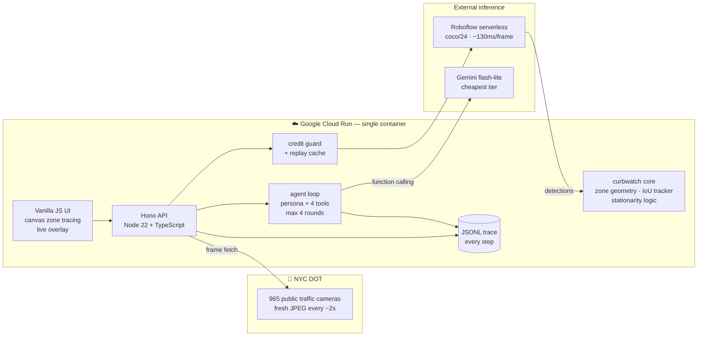
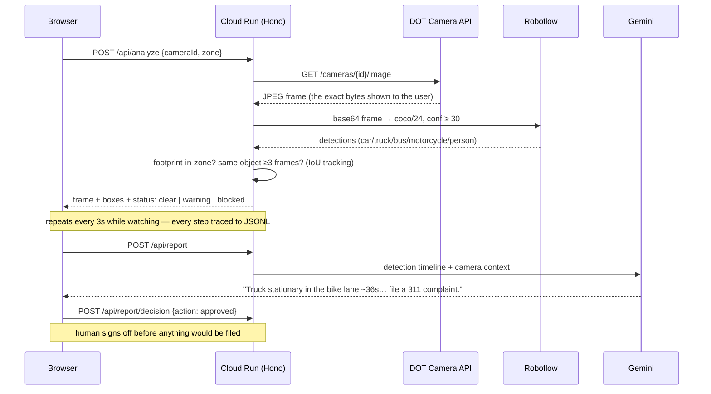
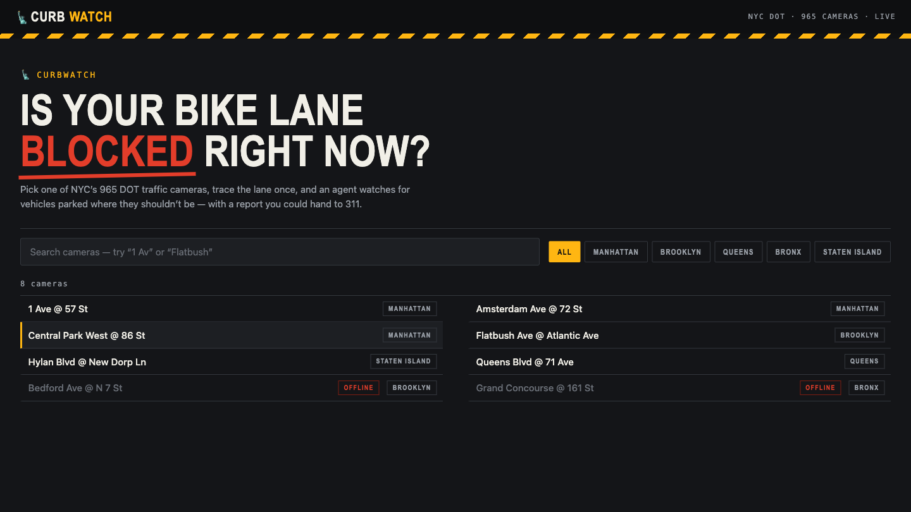

# 🗽 CurbWatch

**An agentic vision system that watches NYC's 965 public traffic cameras and calls out
vehicles blocking bike and bus lanes — with a plain-English report you could hand to 311.**

Built in one evening at [AI Tinkerers NYC — Vision Hack v.2](https://nyc.aitinkerers.org/)
(Aug 7, 2026). Live on **Google Cloud Run**. Detection by **Roboflow**. Reasoning by **Gemini**.

**Live demo:** https://curbwatch-631243785209.us-central1.run.app


## The problem

Double-parking in bike and bus lanes is a daily NYC failure: cyclists forced into moving
traffic, buses delayed, 311 complaints that arrive hours late with no evidence. The city
already points 965 public DOT cameras at these exact lanes, refreshing every few seconds.
CurbWatch turns any one of them into a lane-blockage witness.

## Three features, nothing more

1. **Pick a camera, trace the lane** — search all online DOT cameras, filter by borough,
   then draw the lane zone once as a polygon on the live frame.
2. **Watch it** — CurbWatch polls a frame every 3 s, runs object detection, and tracks each
   vehicle across frames (IoU matching). A vehicle whose footprint sits inside your zone
   for ≥3 consecutive frames is **blocking**; one passing through is ignored.
3. **Ask the agent** — a Gemini-powered agent turns the detection timeline into a
   311-style report (with human **approve / edit / discard** sign-off), and answers
   free-form questions ("is there a camera on Canal St?", "what's the lane status?")
   by choosing its own tools.

Every LLM call, tool call, verdict, and human decision is appended to a **JSONL trace**
(`trace/agent-trace.jsonl`), viewable and downloadable in-app — the raw material for
evaluating and improving the agent, and an honest window into what it actually did.

## Architecture



### The agent's tools

| Tool | What it does | Cost |
|---|---|---|
| `search_cameras` | find cameras by name/borough from the cached list | free |
| `analyze_camera` | one live detection on a camera's current frame | 1 guarded call |
| `lane_status` | current tracker state of the watched lane | free |
| `generate_report` | 311-style verdict from the detection timeline | 1 Gemini call |

## How a frame becomes a verdict



**Why the server fetches the frame:** detection always runs on the *same bytes* the user
sees, so overlays never drift from the picture. It also lets us cache frames for replay
mode and keep every key server-side — the browser never talks to Roboflow or Gemini.

## Staying frugal (limited inference credits)

- Inference is **on-demand only** — frames are analyzed only while someone is actively
  watching a lane, at 1 frame / 3 s. No background polling of 965 cameras.
- A server-side **credit guard** hard-caps total Roboflow calls (`MAX_INFERENCE_CALLS`,
  429 when exhausted) — replay mode is exempt.
- **Replay mode** serves 12 committed frames + cached detections — a zero-credit demo
  fallback in case a camera goes dark on stage.
- Gemini runs on **`gemini-flash-lite-latest`** — the cheapest current tier.

## What works / honest caveats

**Works, verified live:** the full pipeline end-to-end on Cloud Run — real frames, real
detections, IoU dwell tracking, Gemini reports (honest ones: it says "no action needed"
when nothing is blocking), agent chat with tool use, JSONL tracing, HITL decisions,
replay fallback, credit guard.

**Caveats:** some DOT cameras pan/rotate on a schedule, so a traced zone can drift off
the lane — retrace or pick a fixed camera (the demo camera is stable). Sessions and
traces are in-memory/ephemeral on Cloud Run; persistence would be a GCS bucket away.
Detection on 352×240 frames misses small/distant vehicles at night. The tracker is
IoU-greedy — fine for a lane, not for dense multi-object crossings.

## Running it

```bash
cp .env.example .env    # add ROBOFLOW_API_KEY (+ GEMINI_API_KEY for the agent)
npm install
npm run dev             # http://localhost:8080
npm test                # 35 unit tests: geometry, tracker, trace, agent loop
```

### Deploy to Cloud Run

```bash
git clone https://github.com/roshaninfordham/NYC-Vision-Hack-2026.git
cd NYC-Vision-Hack-2026
ROBOFLOW_API_KEY=xxx GEMINI_API_KEY=xxx ./deploy.sh
```

The script auto-grants the Cloud Build role that fresh projects are missing, builds from
the Dockerfile, and prints the service URL.

## Screenshots

| | |
|---|---|
|  |  |
|  |  |

## Privacy

Frames are low-resolution public DOT feeds (352×240). CurbWatch detects *classes*
(car, truck, bus, person counts) — it does not and cannot identify people or read
plates. Nothing persists beyond an in-memory session and the committed demo replay.

## Stack

| Layer | Choice | Why |
|---|---|---|
| Hosting | Google Cloud Run | scale-to-zero, one-command deploy from source |
| Server | Node 22 + TypeScript + Hono | tiny, fast, one container for API + UI |
| Detection | Roboflow serverless, `coco/24` | live-tested most accurate on small 352×240 objects |
| Reasoning | Gemini `flash-lite-latest` | cheapest tier; function calling for the agent loop |
| Frontend | vanilla JS + canvas | no build step, loads instantly, easy to read |
| Observability | JSONL trace + in-app drawer | every agent step auditable + downloadable |

`src/core/` (geometry, tracker, clients) has zero framework dependencies — extractable
as an npm package (`curbwatch-core`) after the event.

## License

MIT
