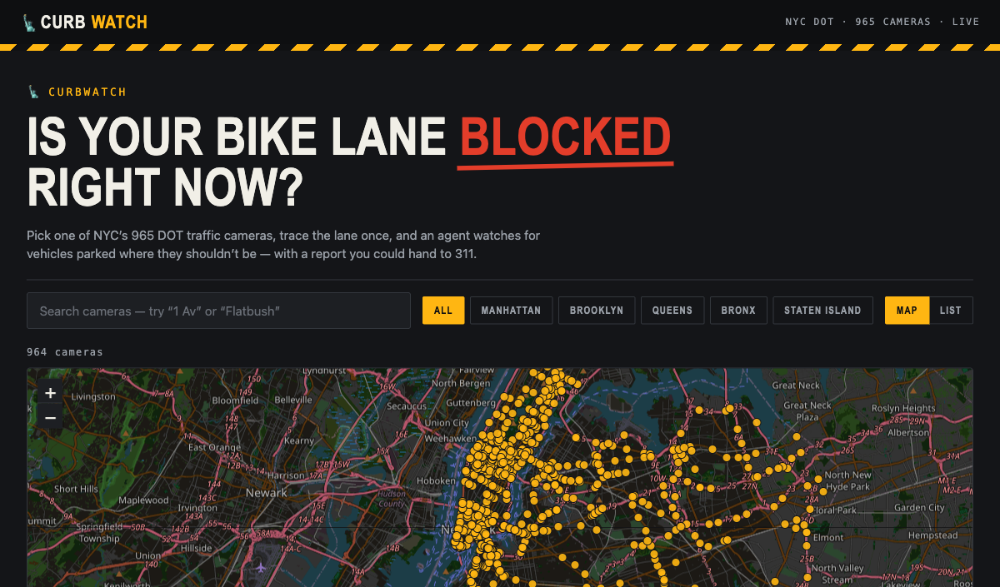
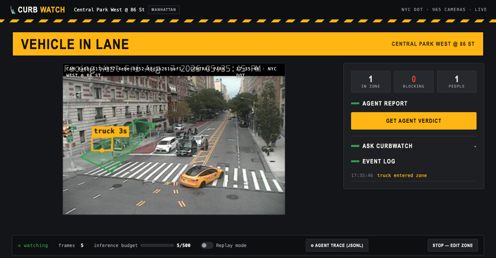
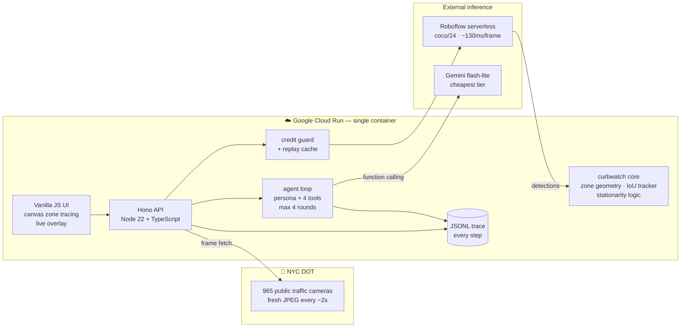
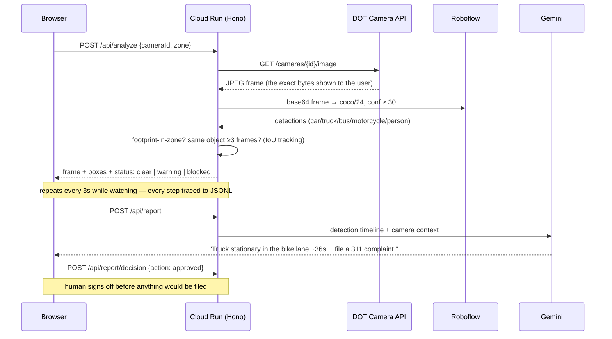
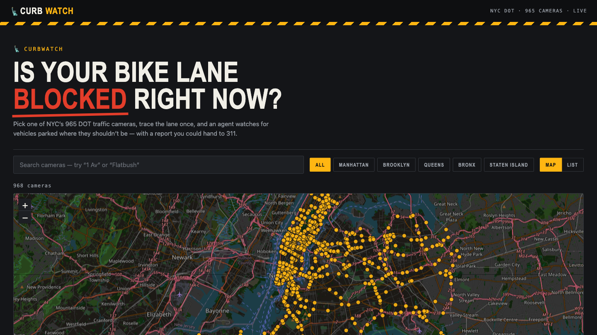
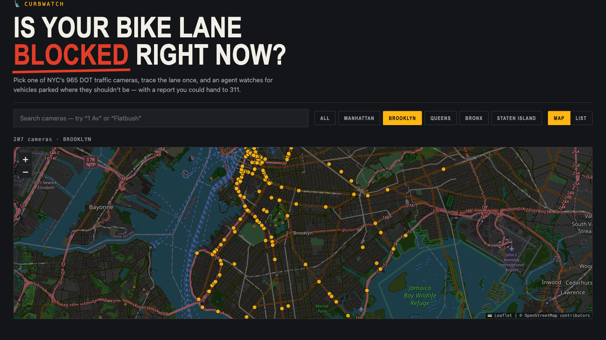
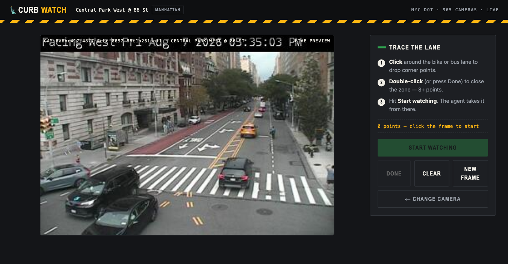
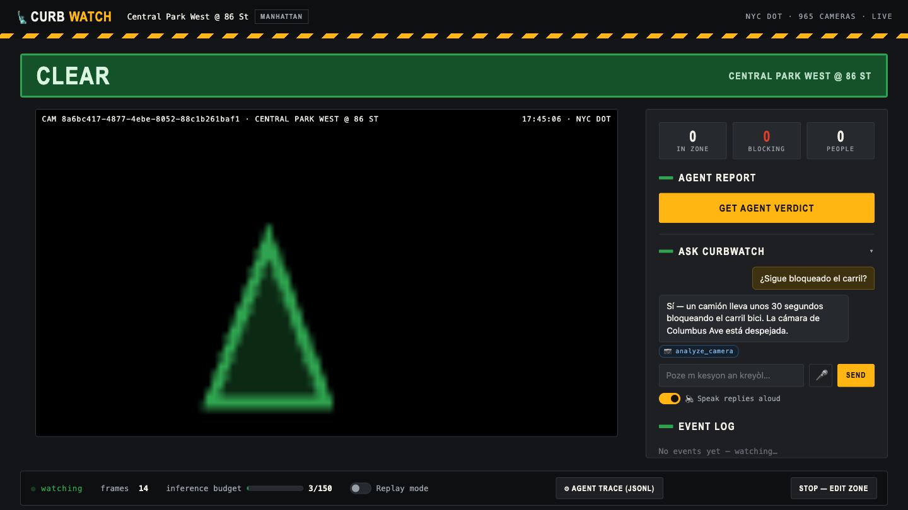
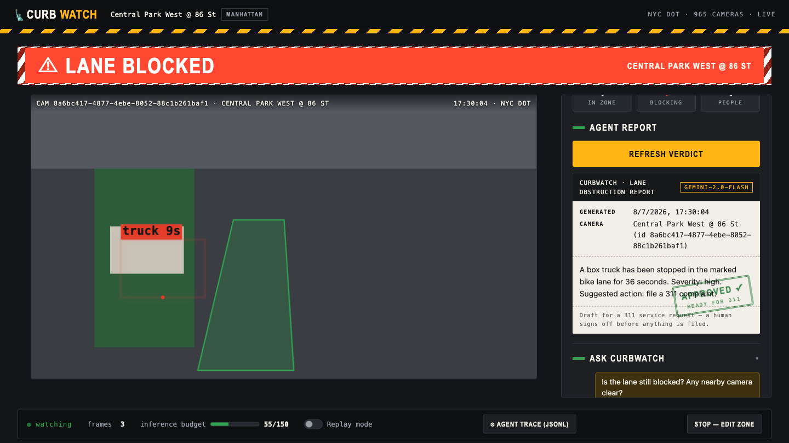
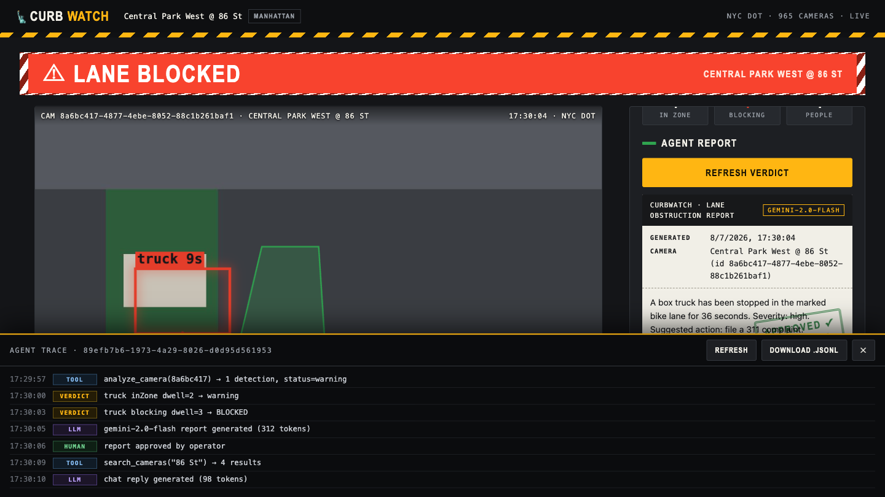

# 🗽 CurbWatch

**An agentic vision system that turns NYC's 965 public traffic cameras into
enforcement-grade witnesses for blocked bike and bus lanes — evidence-quality reports,
human sign-off, any language.**

Built in one evening at [AI Tinkerers NYC — Vision Hack v.2](https://nyc.aitinkerers.org/)
(Aug 7, 2026). Live on **Google Cloud Run**. Detection by **Roboflow**. Reasoning by **Gemini**.

**Live demo:** https://curbwatch-631243785209.us-central1.run.app





## The problem, in numbers

Blocked bike and bus lanes are one of NYC's highest-volume, lowest-enforcement failures:

- NYC 311 receives **over a million illegal-parking complaints a year**, including
  **tens of thousands specifically for blocked bike lanes** — and the volume grows
  every year ([311 open data](https://data.cityofnewyork.us/Social-Services/311-Service-Requests-from-2010-to-Present/erm2-nwe9)).
- The typical complaint is answered **hours later, after the vehicle is gone** — most
  are closed with no action taken, because there is no evidence left to act on.
- The human cost: **~30 cyclists killed and thousands seriously injured** in NYC per
  year ([Vision Zero data](https://www.nyc.gov/site/visionzero/index.page)); every
  blocked bike lane pushes riders into moving traffic.
- The economic cost: NYC buses crawl at **roughly 8 mph** partly due to blocked bus
  lanes, and congestion costs the region an estimated **$20B a year**
  ([Partnership for NYC](https://pfnyc.org/)).

Meanwhile the city **already owns 965 public traffic cameras pointed at these exact
lanes**, refreshing every few seconds — an enforcement sensor network with zero
marginal hardware cost that today is only used for looking, not acting.

## Who it's for

| User | Today | With CurbWatch |
|---|---|---|
| **311 / DOT / enforcement triage** | Respond hours later; blocker gone; complaint closed "no action" | Verify any complaint in ~30 seconds on the live camera; evidence-grade, human-approved report with an auditable AI trail |
| **Advocates & community boards** | Manually watch corners for days to document chronic blockage hotspots | Point CurbWatch at a camera; collect timestamped, downloadable evidence bundles for protected-lane campaigns |
| **Researchers & journalists** | FOIL requests, anecdotes | A reproducible open-source pipeline + JSONL traces of every detection and decision |
| **Any New Yorker, in any language** | 311 friction, English-first forms | Ask the agent by voice or text in any of NYC's 800+ languages; the report files in English automatically |

Cyclists and bus riders are the beneficiaries; the operators are the people with the
power to clear the lane. **CurbWatch is curb intelligence built from cameras the city
already owns.**

## Three features, nothing more

1. **Pick a camera, trace the lane** — every DOT camera on a dark city map (search,
   borough fly-to; list view one toggle away), then draw the lane zone once as a
   polygon on the live frame.
2. **Watch it** — CurbWatch polls a frame every 3 s, runs object detection, and tracks each
   vehicle across frames (IoU matching). A vehicle whose footprint sits inside your zone
   for ≥3 consecutive frames is **blocking**; one passing through is ignored.
3. **Ask the agent — in any language** — a Gemini-powered agent answers free-form
   questions ("is there a camera at Times Square?", "¿está bloqueado el carril?") by
   choosing its own tools, with press-to-talk voice in/out. Reports are **grounded**:
   Gemini *sees the actual frame*, cross-checks the detector's labels against the image,
   corrects mislabels, and writes an evidence-quality 311-style report in your language
   (English appended for filing) — with human **approve / edit / discard** sign-off.

Every LLM call, tool call, verdict, and human decision is appended to a **JSONL trace**
(`trace/agent-trace.jsonl`), viewable and downloadable in-app — the raw material for
evaluating and improving the agent, and an honest window into what it actually did.

## Architecture



### The agent's tools

| Tool | What it does | Cost |
|---|---|---|
| `search_cameras` | find cameras by name/borough from the cached list | free |
| `analyze_camera` | one live detection on a camera's current frame | 1 guarded call |
| `lane_status` | current tracker state of the watched lane | free |
| `generate_report` | 311-style verdict from the detection timeline | 1 Gemini call |

## How a frame becomes a verdict



**Why the server fetches the frame:** detection always runs on the *same bytes* the user
sees, so overlays never drift from the picture. It also lets us cache frames for replay
mode and keep every key server-side — the browser never talks to Roboflow or Gemini.

## Staying frugal (limited inference credits)

- Inference is **on-demand only** — frames are analyzed only while someone is actively
  watching a lane, at 1 frame / 3 s. No background polling of 965 cameras.
- A server-side **credit guard** hard-caps total Roboflow calls (`MAX_INFERENCE_CALLS`,
  429 when exhausted) — replay mode is exempt.
- **Replay mode** serves 12 committed frames + cached detections — a zero-credit demo
  fallback in case a camera goes dark on stage.
- Gemini runs on **`gemini-flash-lite-latest`** — the cheapest current tier.

## What works / honest caveats

**Works, verified live:** the full pipeline end-to-end on Cloud Run — real frames, real
detections, IoU dwell tracking, Gemini reports (honest ones: it says "no action needed"
when nothing is blocking), agent chat with tool use, JSONL tracing, HITL decisions,
replay fallback, credit guard.

**Caveats:** some DOT cameras pan/rotate on a schedule, so a traced zone can drift off
the lane — retrace or pick a fixed camera (the demo camera is stable). Sessions and
traces are in-memory/ephemeral on Cloud Run; persistence would be a GCS bucket away.
Detection on 352×240 frames is imperfect (small/distant vehicles, night) — which is
exactly why reports are grounded: Gemini sees the frame and corrects the detector
before anything reaches a human. The tracker is IoU-greedy — fine for a lane, not for
dense multi-object crossings.

## Demo script (~90 seconds)

1. Open the live URL → the map. "Every dot is a real NYC DOT camera, right now."
2. Search "Central Park West @ 86" → live frame appears → trace the bike lane in 4 clicks.
3. Start watching → detections overlay within 3 s; if a vehicle sits in the zone the
   banner escalates CLEAR → VEHICLE IN LANE → LANE BLOCKED with a dwell timer.
4. "Get agent verdict" → grounded Gemini report citing what's actually in the picture →
   click **Approve** (the human-in-the-loop stamp).
5. Ask the agent *in Spanish* (or by voice): "¿Hay alguna cámara en Times Square?" —
   it translates the landmark to cross-streets and answers in Spanish.
6. Open the **Agent trace** drawer: every LLM/tool/human step as JSONL. If a camera
   dies on stage: flip **Replay mode** — zero-credit committed frames, same pipeline.

## Running it

```bash
cp .env.example .env    # add ROBOFLOW_API_KEY (+ GEMINI_API_KEY for the agent)
npm install
npm run dev             # http://localhost:8080
npm test                # 35 unit tests: geometry, tracker, trace, agent loop
```

### Deploy to Cloud Run

```bash
git clone https://github.com/roshaninfordham/NYC-Vision-Hack-2026.git
cd NYC-Vision-Hack-2026
ROBOFLOW_API_KEY=xxx GEMINI_API_KEY=xxx ./deploy.sh
```

The script auto-grants the Cloud Build role that fresh projects are missing, builds from
the Dockerfile, and prints the service URL.

## A tour in screenshots

**1 — Pick a camera.** 965 taxi-yellow dots on a dark OSM map; search filters live,
borough chips fly the map there. (List view: one toggle.)

|  |  |
|---|---|

**2 — Trace the lane on a live frame, then watch.** The truck below is real — detected
on Central Park West with its dwell timer, inside the traced zone.

|  |  |
|---|---|

**3 — Ask the agent, sign off the report.** Voice or text, any language; the report is
grounded in the actual frame and stamped by a human before it goes anywhere.

|  |  |
|---|---|

**4 — Every agent step is auditable.** The JSONL trace drawer shows each LLM call,
tool call, verdict, and human decision — downloadable for offline evaluation.



## Privacy

Frames are low-resolution public DOT feeds (352×240). CurbWatch detects *classes*
(car, truck, bus, person counts) — it does not and cannot identify people or read
plates. Nothing persists beyond an in-memory session and the committed demo replay.

## Stack

| Layer | Choice | Why |
|---|---|---|
| Hosting | Google Cloud Run | scale-to-zero, one-command deploy from source |
| Server | Node 22 + TypeScript + Hono | tiny, fast, one container for API + UI |
| Detection | Roboflow serverless, `coco/24` | live-tested most accurate on small 352×240 objects |
| Reasoning | Gemini `flash-lite-latest` | cheapest tier; function calling for the agent loop |
| Frontend | vanilla JS + canvas | no build step, loads instantly, easy to read |
| Observability | JSONL trace + in-app drawer | every agent step auditable + downloadable |

`src/core/` (geometry, tracker, clients) has zero framework dependencies — extractable
as an npm package (`curbwatch-core`) after the event.

## License

MIT
